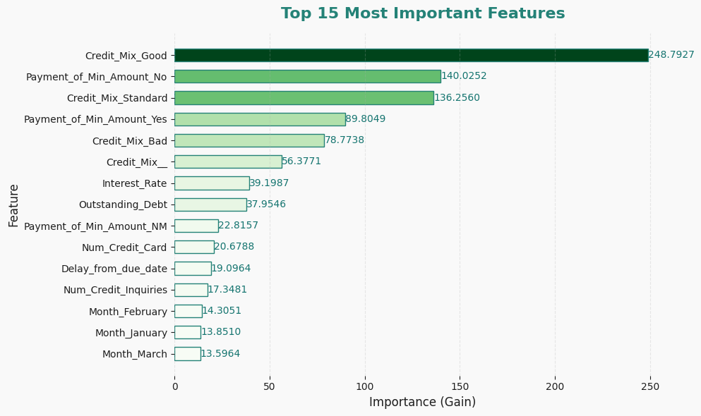
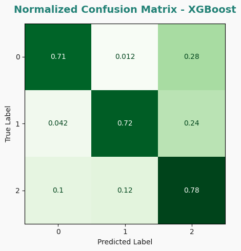

# CreditScore — Machine Learning Credit Risk Model

This repository contains a complete **end-to-end machine learning pipeline** for predicting customer credit scores using real-world financial data.  
The project includes **data preprocessing**, **hyperparameter optimization** with Optuna, **model training** using XGBoost, **MLflow experiment tracking**, and result visualization.

---

## Project Overview

The goal of this project is to build a **credit scoring model** that predicts a customer’s creditworthiness based on their historical financial and behavioral profile.

The pipeline:
1. **Preprocessing & Feature Engineering** — cleaning, encoding, and transforming raw data.  
2. **Hyperparameter Optimization** — tuning XGBoost with **Optuna** and 5-fold CV.  
3. **Model Training & Evaluation** — final model trained with the best parameters.  
4. **Experiment Tracking** — all metrics logged in **MLflow**.  
5. **Visualization** — insights into model performance and feature importance.

---

## Project Structure

CreditScore/
│
├── code/
│   ├── preprocessing.ipynb          # Data cleaning & preparation
│   ├── params_optuna.py             # Hyperparameter optimization with Optuna
│   ├── train_xgb_model.py           # Model training + MLflow logging
│   └── visualizations.ipynb         # Feature importance & confusion matrix
│
├── data/
│   ├── train.csv
│   ├── test.csv
│   ├── train_preprocessed.csv
│   ├── test_preprocessed.csv
│   ├── optuna_xgb_study.pkl
│   └── XGBoost75Accuracy.pkl
│
├── plots/
│   ├── feature_importance.png
│   └── confusion_matrix.png
│
├── mlruns/                          # Auto-generated by MLflow
├── requirements.txt
└── README.md

---

##  Model Details

| Component | Description |
|------------|-------------|
| **Algorithm** | XGBoost (multi-class classification) |
| **Objective** | `multi:softprob` |
| **Optimization** | Optuna (5-fold CV, Median Pruner) |
| **Evaluation Metrics** | Accuracy, F1, Precision, Recall |
| **Tracking** | MLflow experiment logging |
| **Feature Importance** | Gain-based ranking (Top 15 features) |

---

## 📊 Results

| Metric | Score |
|:-------|:------|
| **Accuracy** | 0.75 |
| **Weighted F1-score** | ~0.75 |
| **ROC AUC (multi-class)** | 0.78 |

### 🔹 Top 15 Most Important Features

  

### 🔹 Normalized Confusion Matrix

  

---

## Tools & Technologies

- **Python 3.11**
- **XGBoost** — gradient boosting algorithm  
- **Optuna** — hyperparameter tuning  
- **scikit-learn** — model evaluation & metrics  
- **MLflow** — experiment tracking and model versioning  
- **Matplotlib / Seaborn** — result visualization  
- **Pandas / NumPy** — data handling & preprocessing  

---

## Future Improvements

- Add SHAP explainability to interpret model predictions  
- Build REST API with FastAPI for real-time inference  
- Deploy the model using Docker or Streamlit Cloud  
- Extend MLflow tracking to cloud backend (e.g. DagsHub / AWS S3)

---

## Author

**Bartłomiej Pęk**  
*Machine Learning Engineer / Data Scientist*  
📧 [bartekpek123@gmail.com](mailto:bartekpek123@gmail.com)  
🔗 [linkedin.com/in/bartlomiejpek](https://www.linkedin.com/in/bartlomiejpek)

---
